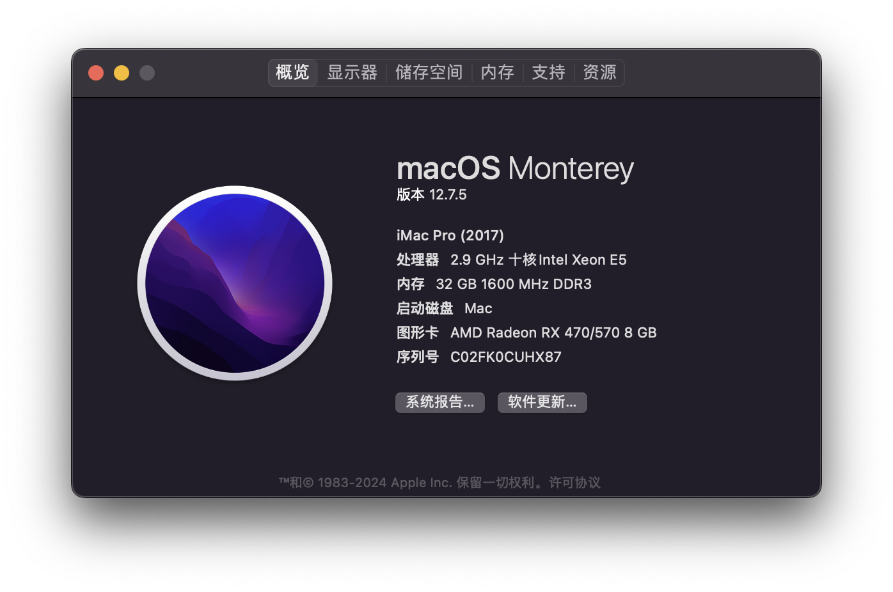
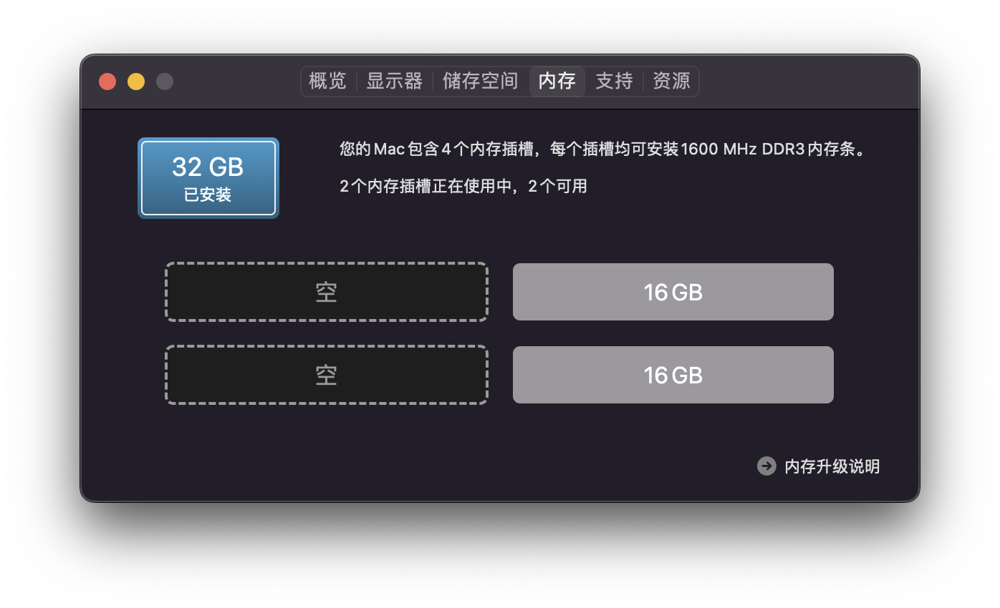
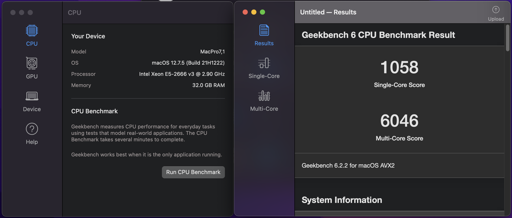
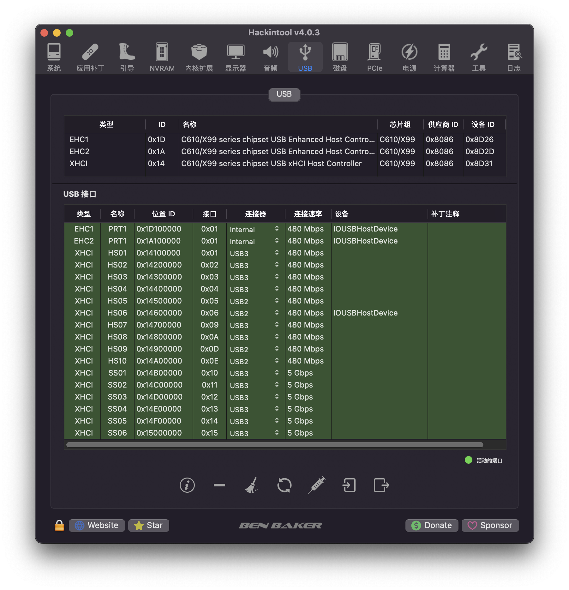

# 配置
- x99d3m4 182
- 2666v3 36
- 16g ecc * 2 54
- rx478 170
- 全汉蓝暴经典 550W 60
- 四热管散热器 24
# BIOS 折腾日记
- e5 2666v3 使用鸡血BIOS 降压60mv测试最稳，r23 跑分 9900 分
- wakeonlan 来电自启 均可在BIOS里开启
    - 来电自启和WakeOnLan已经测试OK
    - 来电自启在PCH state里面，叫 PCH state after G3，设置为on
    - 这样就不用买esp8266这种卡来控制了
- 降压BIOS在BIOS文件夹里
# x99 黑苹果 折腾
- 目前USB映射有问题
- Mac下R23跑分为8800左右，比Window低1000分
- 双系统启动到 window 会转圈卡住

